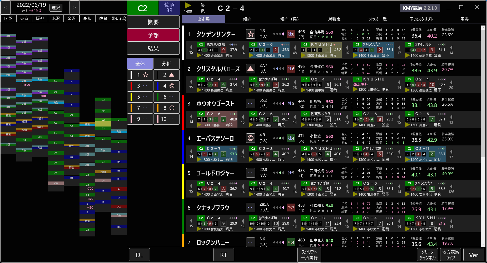
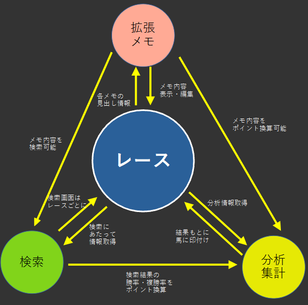

# KMY競馬について

## KMY競馬の概要
KMY競馬は、画面が黒い競馬ソフトが欲しいというただそれだけの理由で開発されました。本当です。それ以上も以下もありません。画面さえ黒ければいいので、機能などは度外視です。競馬として最低限の機能が入っていれば開発者の頭の中では満点です。

KMY競馬では無償ですべての機能をお使いいただけます。またソースコードが公開されており、どなたでも自由にソースコードを改変しビルド・頒布することが可能です。ソースコードは[GitHub](https://github.com/kmycode/kmy-keiba)で公開されており、随時プルリクエストを受け付けております。

最大の留意点として、KMY競馬は動作が遅いことが挙げられます。とにかくさくさくには動かないので、導入の際は覚悟してください。

### UIについて
KMY競馬は、UIが独特です。多くの競馬ソフトが起動時にメニューを表示するというTargetライクなUIを共通して使用しているのに対し、KMY競馬は全く異なるUIを採用しており、他のソフトとの親和性は非常に低いです。実際に拒絶反応があったという報告も受けております。  
KMY競馬はあえてメニューを採用せず、できる限り画面上のボタンを減らすよう設計しました。特定の画面を表示している場合にのみ有効なメニューを、必要でない場合は表示しないようにしました。現在の画面や状況で利用できるボタンを最低限に減らしました。それにより、初めて触る方でもどの画面や機能にアクセスすべきかが明瞭になることを意図しましたが、他の競馬ソフトを使い慣れた方に対する配慮が足りなかったのも事実です。UIに一長一短があるのは確かですが、それでも使ってみたい人は使ってみてください。

ただしUI設計にあたって「馬王Z」をかなり参考にしましたので、そちらに慣れている方はわりと早めになじめるかもしれません。

### こんな人におすすめ
- 競馬ソフトの画面を黒くしたい方
- 予想ファクタ機能（分析・集計）を試してみたい方
- 他の競馬ソフトではできない検索をしてみたい方
- 競馬ソフトの動作は重くないと気がすまない変わった方
- 時間を無意味に浪費しないと死ぬ病気の患者

### こんな人におすすめではない
- 競馬ソフトを初めて使う方　→[Target](https://jra-van.jp/target/)使ってください
- いい競馬ソフトを探している方　→[Target](https://jra-van.jp/target/)使ってください
- 動作の速い競馬ソフトを探してる方　→[Target](https://jra-van.jp/target/)使ってください
- 競馬が大好きな方　→[Target](https://jra-van.jp/target/)使ってください
- 競馬で儲けたい方　→[Target](https://jra-van.jp/target/)使ってください
- 儲からなくていいので競馬を楽しみたい方　→[Target](https://jra-van.jp/target/)使ってください
- 他の人に薦める競馬ソフトを探してる方　→[Target](https://jra-van.jp/target/)使ってください
- とにかく競馬したい方　→[Target](https://jra-van.jp/target/)使ってください
- 多機能な競馬ソフトを探してる方　→[Target](https://jra-van.jp/target/)使ってください
- とりあえず競馬ソフトを使いたい方　→[Target](https://jra-van.jp/target/)使ってください
- パソコン操作に自信の無い方　→[Target](https://jra-van.jp/target/)使ってください
- パソコンのスペックに自信の無い方　→[Target](https://jra-van.jp/target/)使ってください
- 中央競馬と地方競馬を１つのアプリで使いたい方　→[馬王Z](http://www.baoland.com/)使ってください
- 最強の予想ファクタを作って予想を自動化したい方　→[CrossFactor](https://team-d.club/)使ってください。地方競馬の場合は[馬王Z](http://www.baoland.com/)
- Target以外の競馬ソフトを探してる方　→[Target](https://jra-van.jp/target/)使ってください
- 作者の描くエロ漫画が好きな方　→[Target](https://jra-van.jp/target/)使ってください
- それ以外全員　→[Target](https://jra-van.jp/target/)使ってください

## KMY競馬でできること
KMY競馬では、「拡張メモ」「検索」「分析・集計」の三大機能があり、お互いに深く結びついています。

| 名前 | 説明 |
|-|---|
| **レース** | その名の通り、レースの名前、競馬場、内容に関する情報を閲覧することができます |
| **拡張メモ** | レースや馬に自分で定義したデータ項目やメモを追加します |
| **検索** | 過去・未来のレース情報を検索することができます |
| **分析・集計** | レースに出場する各馬に、計算式を使ってポイントを付け比較します。計算式はカスタマイズ可能です |

このの図を見て最初のうちは難しく感じるかもしれませんが、あまり難しく考えず、これらの機能がお互いに関係しているという程度の理解で大丈夫です。

特に「レース」「検索」の部分は他の競馬ソフトにもほとんど必ずある機能ですので、よく分からなければまずここから学ぶのがいいかもしれません。

## マニュアルの各大見出しの簡易解説
以下、マニュアルの目次項目別に簡単に説明します。

### レース一覧・レース情報
レースの出馬表、オッズなどを確認し、簡易的な馬券投票機能を利用できます。当日の損益を簡易的に計算する機能、特定の馬に印をつける機能もあります。

### 検索
過去レース情報を検索できます。検索条件は保存して、後から再度読み込むことが可能です。指定できる検索項目数、可能な検索内容については、JRA-VANに掲載されている競馬ソフトの中ではトップクラスです（開発者個人の感想です）。ただし完全な上位互換ではなく、他のソフトでは可能な検索が本ソフトではできないということもわずかにあります。

検索条件式は、他のソフトでも一般的に可能な絶対値指定のほか、相対値指定も可能です。相対値指定は検索条件を保存する場合、例えば分析・集計機能で多用します。

分析・集計・拡張メモと連携することができます。

### 分析・集計
レースの各パラメータをポイント化したものを、ユーザーが自由に設定可能な独自の計算式で組み合わせて累計ポイントを算出します。その累計ポイントの順序に従って自動的に印を付ける機能があります（他のソフトの言葉を借りて言うなら『予想ファクタ機能』『予想AI自作機能（厳密には違う）』です）。  
ただし自動投票には対応していませんしこれから対応する予定もありませんので、がっつり使う場合は他ソフトと比べると少々面倒かもしれません。またあくまで簡易的な機能ですので、有料ソフトには劣る部分もございます。特に複数のレースをまとめて集計する機能の動作が低速なうえ、大量のメモリやマシンスペックを必要としており実用的でない点は痛いかもしれません。

検索・拡張メモと連携することができます。

### 拡張メモ
レースやそれぞれの馬に様々な種類のメモを記録するだけでなく、独自のパラメータを設定できます。ただそれだけの機能ですし結構地味ですが、検索・分析・集計と連携することで、使い方次第では強力な機能となりえます。

検索・分析・集計と連携することができます。

### スクリプト（上級者向け）
分析・集計機能ははっきり言って貧弱です。それに満足できない方向けに、JavaScriptとKMY競馬独自APIを組み合わせることで、自分なりのオリジナル予想スクリプトを作成することが可能です。プログラミングの知識がある方向けの機能となります。  
かなり面倒な設定が必要になりますが、ディープラーニング機能を簡易的に利用することも可能です。
